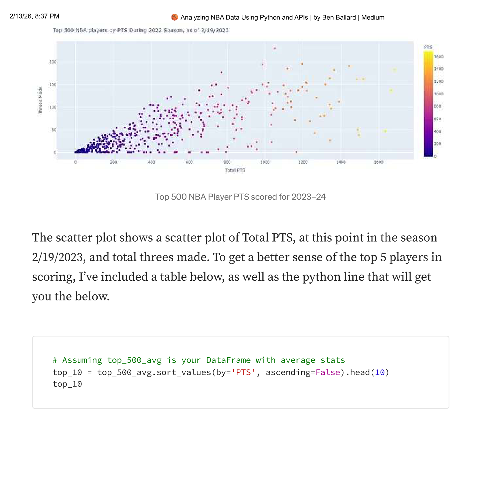
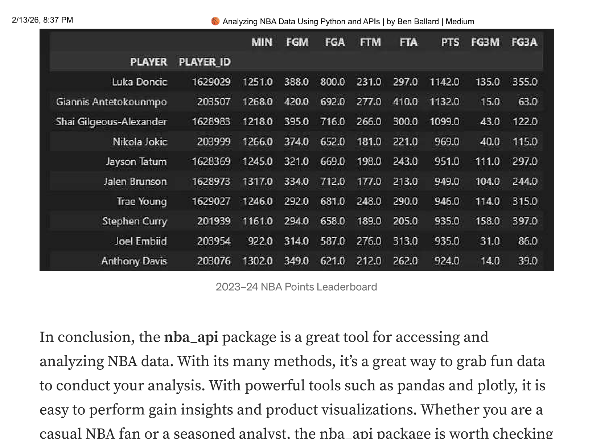

If you're a fan of basketball, you probably love watching NBA games and following your favorite players. But did you know that you can also analyze NBA data using Python and a powerful API? In this blog post, I'll show you how to use the NBA_API to access NBA data, perform statistical analysis, and create visualizations.

The NBA has become a staple in American culture and as technology has progressed, accessing NBA data has become increasingly easier. There are several NBA APIs available on the web, but for the purpose of this analysis, we will focus on the `nba_api` package. The `nba_api` is an API Client for [nba.com](https://www.nba.com). This package's stated goal is to make the APIs of NBA.com easily accessible and provide accessible documentation. This package is open-source.

## NBA API

Using the `nba_api` package, it is simple to write a script or program that can request and parse NBA data. The `nba_api` provides many methods such as `get_players()`, `playercareerstats()`, etc. These methods can be used to pull data from the NBA API and transform it into a pandas dataframe.

Let's look at an example. The following script pulls data for the top 500 scorers by PTS column, groups them by player name and Player ID columns, and calculates their averages for MIN, FGM, FGA, FTM, FTA, PTS, FG3M, FG3A, and GP columns.

```{python}
from nba_api.stats.endpoints import leagueleaders
import pandas as pd

try:
    # Pull data for the top 500 scorers
    top_500 = leagueleaders.LeagueLeaders(
        season='2023-24',
        season_type_all_star='Regular Season',
        stat_category_abbreviation='PTS'
    ).get_data_frames()[0][:500]

    # Correct column names for grouping
    avg_stats_columns = ['MIN', 'FGM', 'FGA', 'FTM', 'FTA', 'PTS', 'FG3M', 'FG3A']
    top_500_avg = top_500.groupby(['PLAYER', 'PLAYER_ID'])[avg_stats_columns].mean()

    # Inspect the first few rows of the averaged stats
    print(top_500_avg.head())

except Exception as e:
    print(f"An error occurred: {e}")
```

The `leagueleaders.LeagueLeaders()` method takes in parameters such as the season and stat category abbreviation to pull data for the top 500 players by points scored per game for the specified season. The `get_data_frames()` method returns a list of data frames, with the first item in the list containing the data we want. We then filter out the top 500 players and group them by name and player ID using the `groupby()` method. Finally, we calculate the average values for the desired columns.

## Visualization

Once we have our data in a pandas dataframe, we can perform additional analysis on it. For example, we can plot the total points scored versus the number of three-pointers made using plotly.

```{python}
import plotly.express as px

# Reset index to turn 'PLAYER' and 'PLAYER_ID' back into regular columns
df_for_plotting = top_500_avg.reset_index()

# Create a scatter plot with colors based on 'PTS'
fig = px.scatter(
    df_for_plotting,
    x='PTS',
    y='FG3M',
    hover_name='PLAYER',
    color='PTS',
    color_continuous_scale=px.colors.sequential.Viridis
)

fig.show()
```

This will display an interactive scatter plot of the average number of three-pointers made versus the total points scored for each player in the top 500.



The scatter plot shows Total PTS at this point in the season (2/19/2023) and total threes made. To get a better sense of the top players in scoring, I've included a table below.

```{python}
# Assuming top_500_avg is your DataFrame with average stats
top_10 = top_500_avg.sort_values(by='PTS', ascending=False).head(10)
top_10
```



## What's Next

The `nba_api` package is a great tool for accessing and analyzing NBA data. With its many methods, it's a great way to grab fun data to conduct your analysis. With powerful tools such as pandas and plotly, it is easy to gain insights and produce visualizations. Whether you are a casual NBA fan or a seasoned analyst, the `nba_api` package is worth checking out.

If you want to go deeper, I've created a more detailed post on the NBA API and manipulating the data in Python: [Analyze NBA Stats with the NBA API and Python](../nba-stats-api-python/).

---

*Originally published on [Medium](https://medium.com/@ben.g.ballard) on February 19, 2023.*
