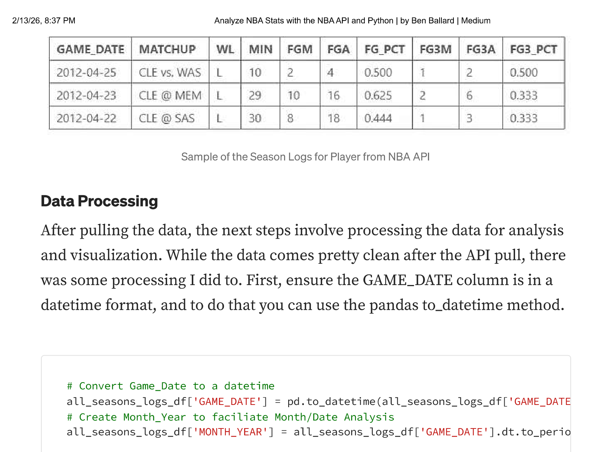
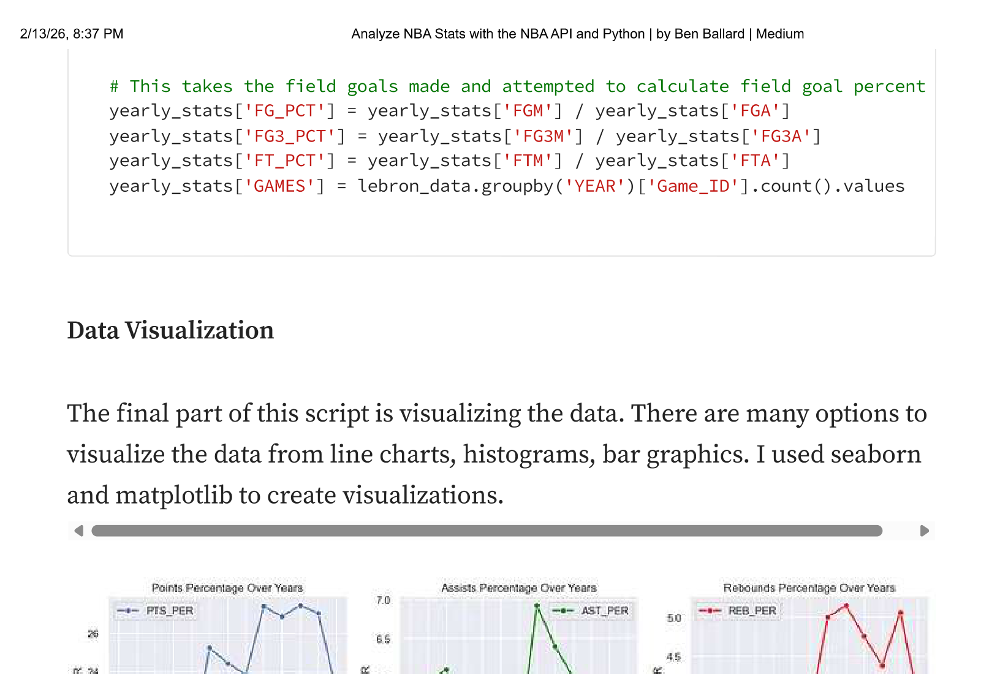
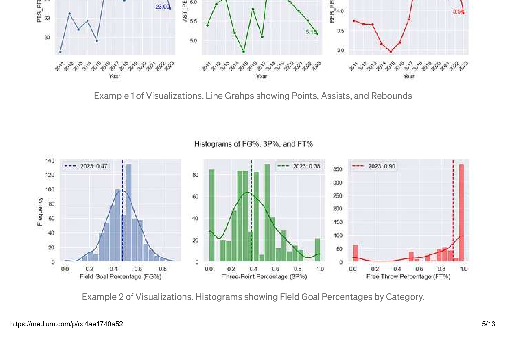
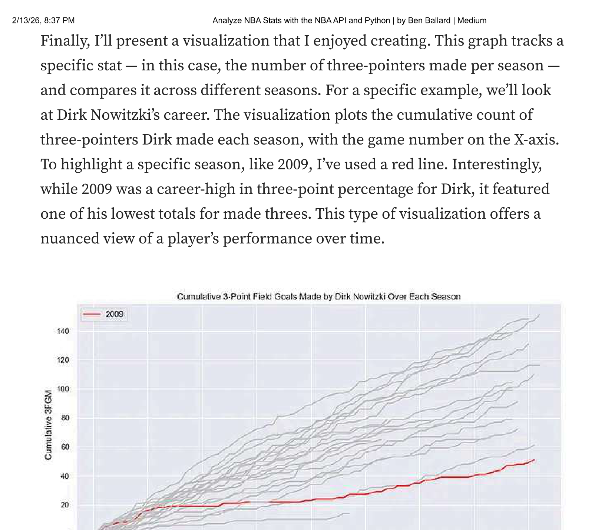

This post is a walk-through on how I created a process using Python to pull NBA data through the NBA API and analyze player career stats like field goal percentages, points, rebounds and assists. In particular, I'll focus on how I pulled from the NBA API, the pandas data processing, and the matplotlib visualizations.

## Gathering the Data

The first step is identifying what player you'd like to analyze. Use the player ID to pull their career stats. Replace the current ID `'202681'` with whatever the new player ID is.

The code utilizes the `nba_api.stats.endpoints` module, specifically tapping into `playercareerstats`. This function will fetch the comprehensive career statistics of your chosen player.

```{python}
from nba_api.stats.endpoints import playercareerstats

# Fetching career statistics for Player of Choice using his player ID
player_career = playercareerstats.PlayerCareerStats(player_id='202681')
player_career_df = player_career.get_data_frames()[0]

# Extracting the seasons of player of choice
seasons_played = player_career_df['SEASON_ID'].unique()
print(seasons_played.tolist())
```

The above code will print out the number of seasons the NBA player you chose played in a list like this: `['2019-20', '2020-21', '2021-22', '2022-23', '2023-24']`. Copy the years output and replace the list of seasons below.

```{python}
import matplotlib.pyplot as plt
import pandas as pd
from nba_api.stats.endpoints import playergamelog

# Initialize an empty DataFrame to store all game logs
all_seasons_logs_df = pd.DataFrame()

# List of seasons to loop through (update this list as needed)
seasons = ['2019-20', '2020-21', '2021-22', '2022-23', '2023-24']

# Fetch game logs for each season and add a 'SEASON' column
for season in seasons:
    player_logs = playergamelog.PlayerGameLog(player_id='202681', season=season)
    season_logs_df = player_logs.get_data_frames()[0]
    season_logs_df['SEASON'] = season
    all_seasons_logs_df = pd.concat([all_seasons_logs_df, season_logs_df], ignore_index=True)
```

After running the above, the `all_seasons_logs_df` dataframe will include all game data for the player of interest. The table includes many more stats, but here's a small example of what is contained in the data.



## Data Processing

After pulling the data, the next steps involve processing the data for analysis and visualization. While the data comes pretty clean after the API pull, there was some processing I did. First, ensure the GAME_DATE column is in a datetime format using the pandas `to_datetime` method.

```{python}
# Convert Game_Date to a datetime
all_seasons_logs_df['GAME_DATE'] = pd.to_datetime(all_seasons_logs_df['GAME_DATE'])

# Create Month_Year to facilitate Month/Date Analysis
all_seasons_logs_df['MONTH_YEAR'] = all_seasons_logs_df['GAME_DATE'].dt.to_period('M')
```

Creating summary tables is important for understanding the data and building narratives for story-telling. I used the following code to create a yearly aggregation of the game level stats to tell the story of a player's career.

```{python}
# Aggregate game level data to yearly
yearly_stats = all_seasons_logs_df.groupby('YEAR').agg({
    'FGM': 'sum',
    'FGA': 'sum',
    'FG3M': 'sum',
    'FG3A': 'sum',
    'FTM': 'sum',
    'FTA': 'sum',
}).reset_index()

# Calculate field goal percentages
yearly_stats['FG_PCT'] = yearly_stats['FGM'] / yearly_stats['FGA']
yearly_stats['FG3_PCT'] = yearly_stats['FG3M'] / yearly_stats['FG3A']
yearly_stats['FT_PCT'] = yearly_stats['FTM'] / yearly_stats['FTA']
```

## Data Visualization

The final part of this script is visualizing the data. There are many options to visualize the data from line charts, histograms, bar graphics. I used seaborn and matplotlib to create visualizations.





Finally, I'll present a visualization that I enjoyed creating. This graph tracks a specific stat — in this case, the number of three-pointers made per season — and compares it across different seasons. The visualization plots the cumulative count of three-pointers made each season, with the game number on the X-axis. To highlight a specific season, like 2009, I've used a red line. Interestingly, while 2009 was a career-high in three-point percentage, it featured one of the lowest totals for made threes. This type of visualization offers a nuanced view of a player's performance over time.



In order to get that graphic to work, we must first create the cumulative sum of threes (FG3M) for each season.

```{python}
# Calculate Cumulative Sum
all_seasons_logs_df['FG3M_CUMSUM'] = all_seasons_logs_df.groupby('YEAR')['FG3M'].cumsum()
all_seasons_logs_df['FGM_CUMSUM'] = all_seasons_logs_df.groupby('YEAR')['FGM'].cumsum()
```

Finally, this code snippet is designed to plot a distinct line for each season, representing the cumulative field goals made by the player. I've chosen red for the 2023 season to make it stand out against the others which will be grey.

```{python}
# Plotting a line for each season
for year in all_seasons_logs_df['YEAR'].unique():
    season_data = all_seasons_logs_df[all_seasons_logs_df['YEAR'] == year]

    # Plot a Particular Year of Interest Red
    color = 'red' if year == 2023 else 'silver'
    label = f'{year}' if year == 2023 else None
    plt.plot(season_data['Game_Number'], season_data['FGM_CUMSUM'], label=label, color=color)

plt.title('Cumulative Field Goals Made by Player Over Each Season')
plt.xlabel('Game Number')
plt.ylabel('Cumulative FG Made')
```

## What's Next

I plan to revisit this in a few days and work on a few areas. Specifically:

- **Dynamic Season List:** Instead of hardcoding the seasons list, dynamically generate it based on the player's career data. This would make the script more flexible and reduce the need for manual updates.
- **Modularization:** Break down the notebook into functions for specific tasks (fetching data, processing data, and plotting). This will make the code more organized and reusable.
- **Documentation:** Adding more comments and explanations throughout the script. Once I clean it up, I plan to post to my GitHub.

Hope you found value in this. Please let me know. I'm always interested in other points of view and learning from others on how to improve my analysis process.

---

*Originally published on [Medium](https://medium.com/@ben.g.ballard) on December 11, 2023.*
