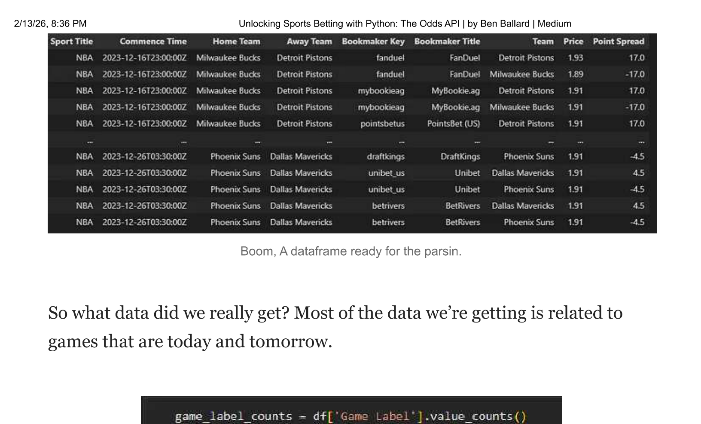
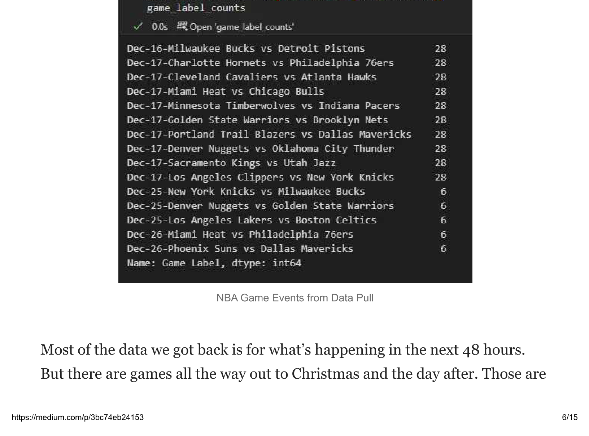
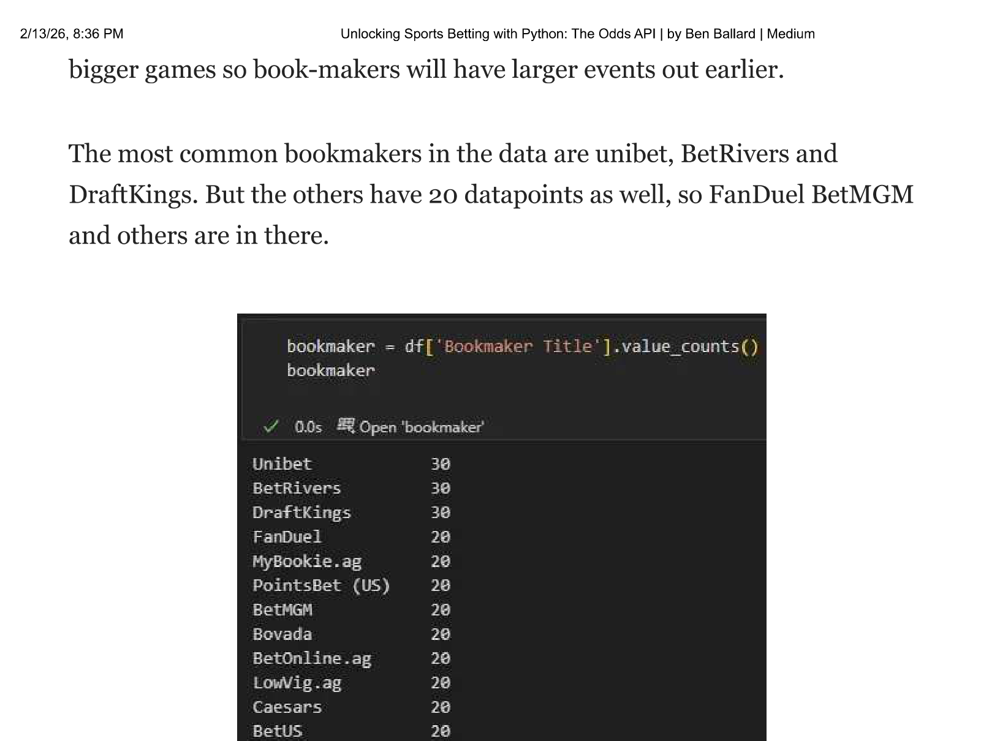
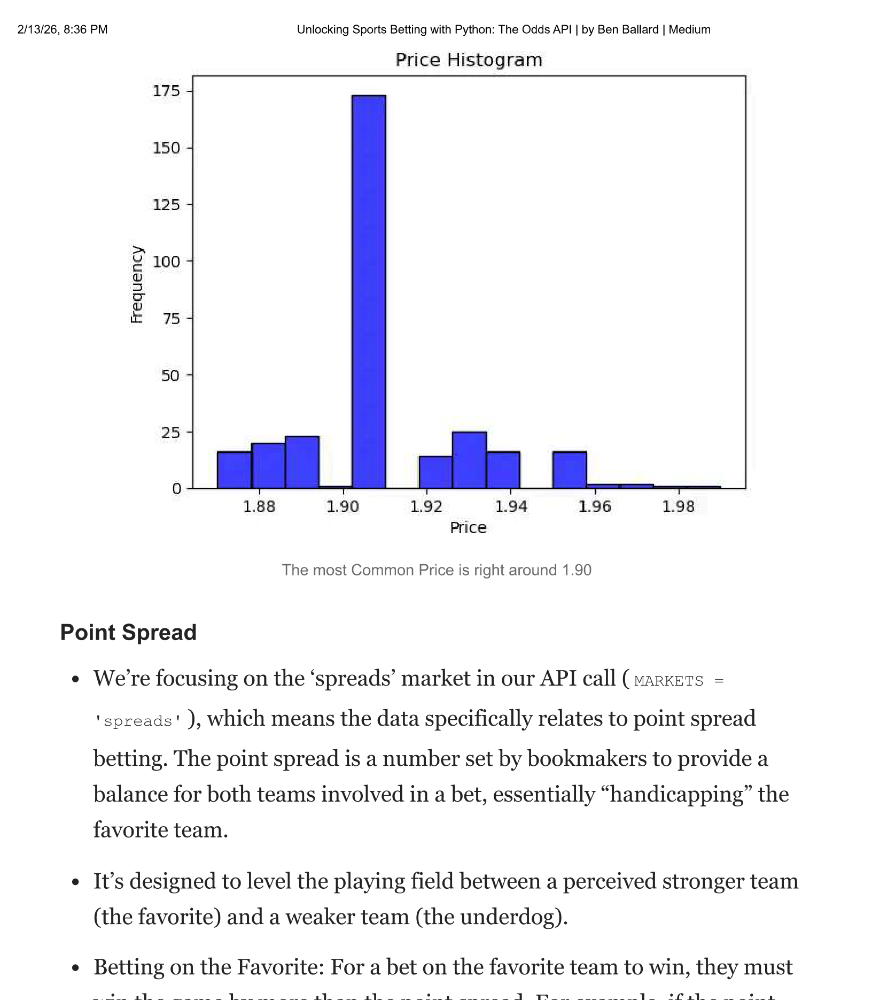
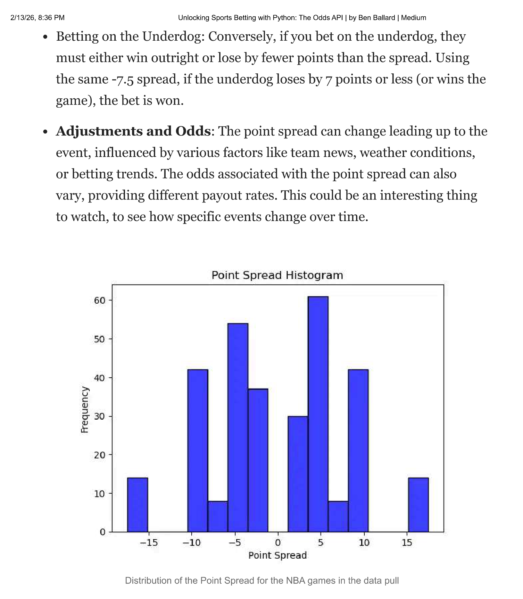
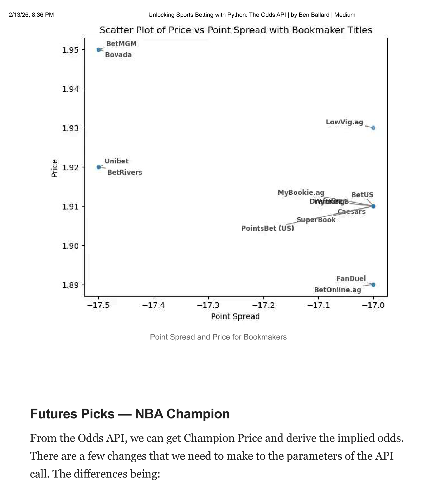
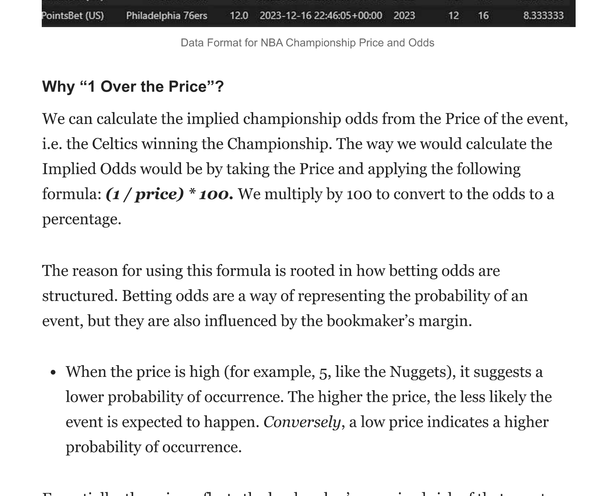
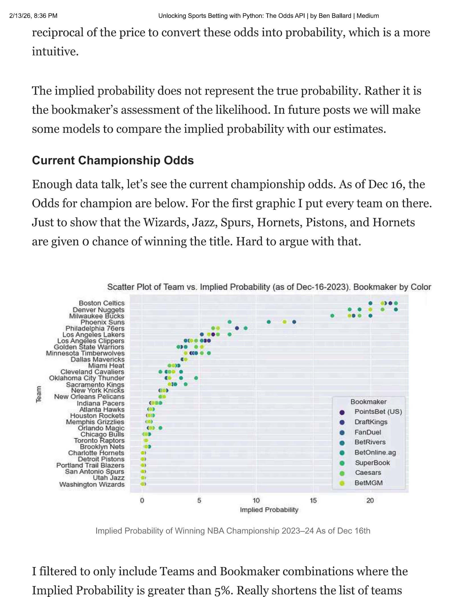
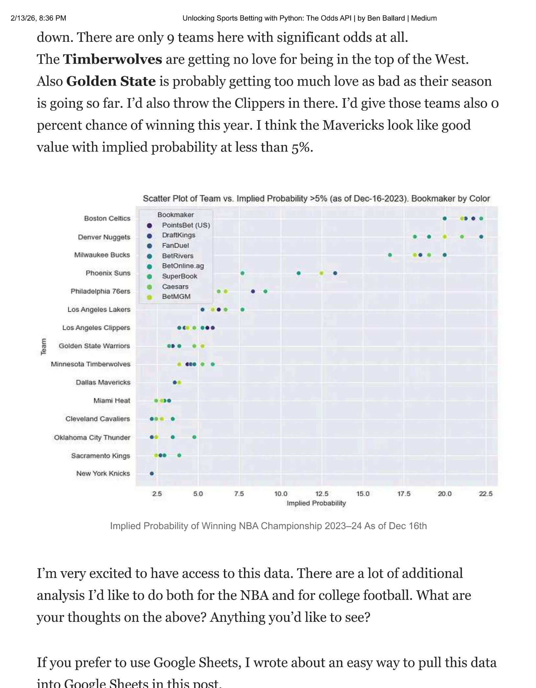

This article explains how to access The Odds API using Python. We'll cover the basics of obtaining an API key, using a Python script to pull from the API, wrangling the data, and then making an absolute ton of money. Anyway, this will provide enough code for you to be dangerous out there.

*Public Service Announcement: Even if we're using Python and data... it's still gambling. Careful out there.*

I've made it for you easy below with the exact code you will need. First open your favorite python IDE like Jupyter Notebook or VS Code. From there you need to obtain an API key from [The Odds API](https://the-odds-api.com), which allows 500 requests per month.

## Importing Libraries and API Setup

- Use the `requests` library for HTTP requests. Install it via pip if not already present.
- Obtain an API key from The Odds API.
- Key parameters include `SPORT`, `REGIONS`, `MARKETS`, `ODDS_FORMAT`, and `DATE_FORMAT`.

The below will work. Money Back Guarantee. Just get your own API key.

```{python}
import requests
import os

# Replace with your actual API key
API_KEY = 'YOUR_API_KEY'

# Setting parameters for NBA Basketball odds and spreads
SPORT = 'basketball_nba'  # NBA sport key
REGIONS = 'us'  # Focusing on US region
MARKETS = 'spreads'  # Focusing on spreads market
ODDS_FORMAT = 'decimal'  # Using decimal format for odds
DATE_FORMAT = 'iso'  # Using ISO format for dates

# Fetching in-season sports (optional step, but useful for confirmation)
sports_response = requests.get(
    'https://api.the-odds-api.com/v4/sports',
    params={'api_key': API_KEY}
)

if sports_response.status_code == 200:
    print(f"List of in season sports", sports_response.json())
else:
    print(f"Failed to get sports: status_code {sports_response.status_code}, response body {sports_response.text}")

# Fetching NBA odds
odds_response = requests.get(
    f'https://api.the-odds-api.com/v4/sports/{SPORT}/odds',
    params={
        'api_key': API_KEY,
        'regions': REGIONS,
        'markets': MARKETS,
        'oddsFormat': ODDS_FORMAT,
        'dateFormat': DATE_FORMAT,
    }
)

if odds_response.status_code == 200:
    odds_json = odds_response.json()
    print("Number of NBA events:", len(odds_json))
    print(odds_json)  # This prints the fetched odds data
    # Check the usage quota
    print("Remaining requests", odds_response.headers['x-requests-remaining'])
    print("Used requests", odds_response.headers['x-requests-used'])
else:
    print(f"Failed to get odds: status_code {odds_response.status_code}, response body {odds_response.text}")
```

**Data:** After running the above code, with this API you can access these data fields:

- **Event ID**: Unique identifier for each game
- **Sport Key**: Identifier for the sport (in this case, NBA basketball)
- **Sport Title**: The title of the sport
- **Commence Time**: Start time of the game
- **Home Team** and **Away Team**: Teams playing the game
- **Bookmaker Key** and **Bookmaker Title**: Identifier and name of the bookmaker offering the odds
- **Team**: The team for which the odds are given
- **Price**: The betting odds price
- **Point Spread**: The point spread for the bet

## Flattening the Data

The above code pulls data for upcoming games. And then if you want the data to be nice and clean, instead of a JSON, the below should work for ya.

```{python}
import pandas as pd

odds_data = odds_json

# Prepare lists to hold extracted data
events = []
for event in odds_data:
    event_id = event['id']
    sport_key = event['sport_key']
    sport_title = event['sport_title']
    commence_time = event['commence_time']
    home_team = event['home_team']
    away_team = event['away_team']

    for bookmaker in event['bookmakers']:
        bookmaker_key = bookmaker['key']
        bookmaker_title = bookmaker['title']

        for market in bookmaker['markets']:
            if market['key'] == 'spreads':
                for outcome in market['outcomes']:
                    team = outcome['name']
                    price = outcome['price']
                    point = outcome['point']

                    # Append each record to the events list
                    events.append((event_id, sport_key, sport_title, commence_time,
                                   bookmaker_key, bookmaker_title, team, price,
                                   point))

# Create a DataFrame from the events list
columns = ['Event ID', 'Sport Key', 'Sport Title', 'Commence Time', 'Home Team',
           'Bookmaker Key', 'Bookmaker Title', 'Team', 'Price', 'Point Spread']
df = pd.DataFrame(events, columns=columns)

# Display the DataFrame
print(df)
```

## What's the Data Look Like?



Boom. A dataframe ready for the parsin'.

So what data did we really get? Most of the data we're getting is related to games that are today and tomorrow.



Most of the data we got back is for what's happening in the next 48 hours. But there are games all the way out to Christmas and the day after. Those are bigger games so bookmakers will have larger events out earlier.

The most common bookmakers in the data are Unibet, BetRivers and DraftKings. But the others have 20 datapoints as well, so FanDuel, BetMGM and others are in there.



## Price and Point Spread

What does Price and Point Spread really mean? Let's explore and analyze the data.

### Price

In sports betting, 'Price' refers to the odds offered by the bookmaker for a specific event or game outcome. These odds are a representation of the probability of an event occurring, estimated by the bookmaker.

The price determines how much a bettor can win. If the price (or odds) is 2.0 and you bet $100, you would win $200 (including your original stake) if your bet is successful.

**Types of Odds**: The format can vary — common types include **decimal odds** (e.g., 2.0), fractional odds (e.g., 1/1), and American odds (e.g., +100). We're using the 'decimal' format for odds in our API call (`ODDS_FORMAT = 'decimal'`), so the 'Price' column represents the decimal odds offered by bookmakers.

**Implications**: The odds reflect the bookmaker's assessment of the event's likelihood, and they are adjusted based on various factors, including team performance, injuries, and betting patterns.

- **For Example:** A decimal odd of 1.93 means if you bet $1, you will receive $1.93 in return if you win (which includes your original stake). This format is straightforward and commonly used due to its simplicity in understanding potential returns.



### Point Spread

We're focusing on the 'spreads' market in our API call (`MARKETS = 'spreads'`), which means the data specifically relates to point spread betting. The point spread is a number set by bookmakers to provide a balance for both teams involved in a bet, essentially "handicapping" the favorite team.

It's designed to level the playing field between a perceived stronger team (the favorite) and a weaker team (the underdog).

- **Betting on the Favorite:** For a bet on the favorite team to win, they must win the game by more than the point spread. For example, if the point spread is -7.5, the favorite team must win by 8 points or more.
- **Betting on the Underdog:** Conversely, if you bet on the underdog, they must either win outright or lose by fewer points than the spread. Using the same -7.5 spread, if the underdog loses by 7 points or less (or wins the game), the bet is won.
- **Adjustments and Odds:** The point spread can change leading up to the event, influenced by various factors like team news, weather conditions, or betting trends. The odds associated with the point spread can also vary, providing different payout rates.



To add a little more color, this is what it looks like for the Dec-16 Milwaukee Bucks vs Detroit Pistons game. This shows that there's some difference in Point Spread and the Price for the different Bookmakers.



## Futures Picks — NBA Champion

From the Odds API, we can get Champion Price and derive the implied odds. There are a few changes that we need to make to the parameters of the API call. The differences being:

- `Sport = 'basketball_nba_championship_winner'` — this changes the API to pull NBA Championship Winner data, versus specific games
- `MARKETS = 'outrights'` — Focusing on outright market for futures bets

We do have to calculate Implied Odds. Once we do that, we have a dataset that looks like this:



### Why "1 Over the Price"?

We can calculate the implied championship odds from the Price of the event. The formula: **(1 / price) * 100**. We multiply by 100 to convert the odds to a percentage.

The reason for using this formula is rooted in how betting odds are structured. Betting odds represent the probability of an event, but they are also influenced by the bookmaker's margin.

When the price is high (for example, 5, like the Nuggets), it suggests a lower probability of occurrence. *Conversely*, a low price indicates a higher probability. The price reflects the bookmaker's perceived risk. A price of 5 suggests a 1 in 5 chance. The implied probability is the reciprocal of the price.

The implied probability does not represent the true probability. Rather it is the bookmaker's assessment of the likelihood. In future posts we will make some models to compare the implied probability with our estimates.

### Current Championship Odds

Enough data talk, let's see the current championship odds. As of Dec 16, the odds for champion are below. For the first graphic I put every team on there. Just to show that the Wizards, Jazz, Spurs, Hornets, and Pistons are given 0 chance of winning the title. Hard to argue with that.



I filtered to only include Teams and Bookmaker combinations where the Implied Probability is greater than 5%. Really shortens the list of teams down. There are only 9 teams here with significant odds at all. The **Timberwolves** are getting no love for being in the top of the West. Also **Golden State** is probably getting too much love as their season is going so far. I'd also throw the Clippers in there. I'd give those teams also 0 percent chance of winning this year. I think the Mavericks look like good value with implied probability at less than 5%.



## What's Next

I'm very excited to have access to this data. There are a lot of additional analysis I'd like to do both for the NBA and for college football. What are your thoughts on the above? Anything you'd like to see?

---

*Originally published on [Medium](https://medium.com/@ben.g.ballard/unlocking-sports-betting-with-python-the-odds-api-3bc74eb24153) on December 16, 2023.*
